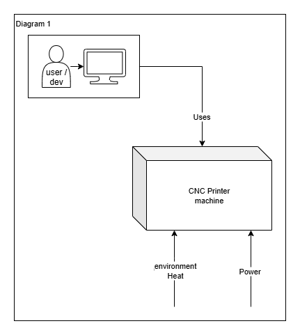
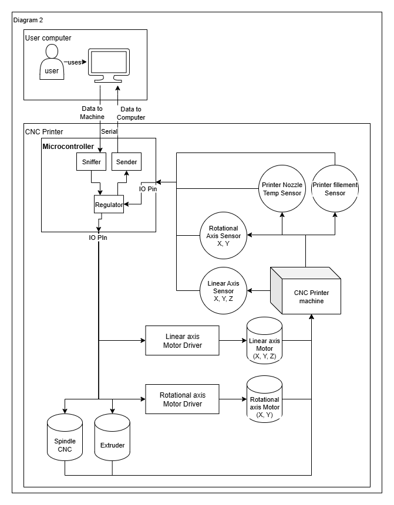
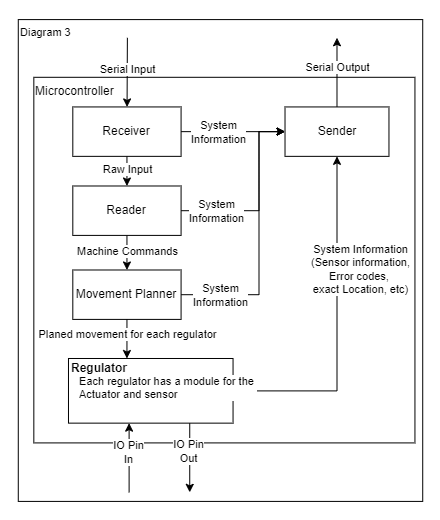
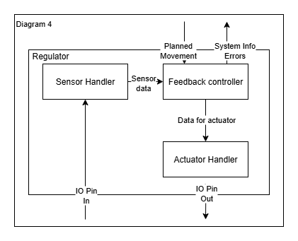

# Systeem Diagrammen

## Machine
De machine is een hybride productie systeem. Dat betekend dat er zowel additieve en subtractieve processen uitgevoerd kunnen worden. Hierbij gaat het over 3D-printen en CNC-snijden. Deze machine heeft een paar invloeden van buiten het systeem. De gebruiker heeft invloed op het systeem door bepaalde commando's uit te voeren. Ook heeft de machine stroom nodig. Daarnaast kan de omgevings tempratuur ook een rol spelen voor bepaalde sensoren.  
  
*Diagram 1: invloeden uit de omgeving.*

De gebruiker kan een monteur, ontwikkelaar of iemand die iets wilt printen zijn. Want alle commando's gaan door dezelfde interace.

De omgevings tempratuur kan invloed hebben op gevoelige sensoren. Deze worden verder in de documentatie verwaarloost.

Er is stroom nodig voor de componenten. Hiervoor is een aansluiting naar het net nodig.

## Onderdelen
De machine bestaat uit hardware en software en de interfaces ertussen. 

### Connecties
Er zijn 2 verschillende soorten interfaces. interface connectie tussen de microcontroller en de gebruikers computer en de interface tussen de microcontroller en de hardware. Deze zijn te zien op Diagram 2.

### Hardware
De hardware bestaat uit actuatoren en sensoren. Sommige actuatoren worden aangestuurd doormiddel van een driver board. Dat board levert ook indien nodig de extra voltage die nodig is voor de actuator.

*Diagram 2: Hardware*

De hardware is verbonden aan de microcontroller. Ieder systeem op een eigen IO pin. Als een actuator moet weten wat de status is is er ook een sensor die die status kan bepalen. Als dit het geval is dan zit er een software regelaar tussen de sensor en actuator. 

### Software

*Diagram 3: Software*
# TODO -> sniffer -> receiver
**Sniffer**  
De sniffer luistert naar al het binnenkomend verkeer. Deze geeft dan een sijntje om de raw data te gaan gebruiken.

**Reader**  
De reader haalt de data op en gaat deze in commando's verdelen die uit te voeren zijn. Systeem commando's worden hiervan direct uitgevoerd. Wanneer er een beweging gemaakt moet worden zal de reader de commando's formateren om te geven aan de movement planner.

**Movement Planner**  
De movement planner gebruikt de geformateerde commando's van de reader om een planning te maken om het doel te bereiken. Hieruit komt een pad met de bewegingen van alle motoren. Deze bepaald ook de snelheden van de motoren. Ook word hier bepaald wat de ander actuatoren doen.

**Regulator**  
De regelaar gebruikt het geplande pad om zijn aangewezen actuator aan te sturen. Als deze actuator feedback nodig heeft van een sensor zal de regelaar ook sensor data binnen krijgen. Hiermee kan die de snelheid en richting van de motor corrigeren als dat nodig is. 

  
*Diagram 4: Regulator*

##### *Sensor Handler*  
De sensor handler ontvangt de raw sensor data van de sensor en zet het om in sensordata dat in standaard eenheden is. Hierdoor kan de de sensor makkerlijk worden verwisseld met een ander soort.

##### *Feedback controller*  
De feedback controller gebruikt het geplande pad en de sensor data om de actuator handler aan te sturen. Deze functie doet alle calculatie om ervoor te zorgen dat het pad gevolgd word. Deze functie geeft ook op commando de sensor data door. Maar geeft ook error's

**Sender**    
De sender stuurt alle data dat naar de gebruiker moet. Dit zijn status updates, error codes, sensor informatie, systeem informatie etc.

De microcontroller bestaat uit meerdere onderdelen. De sniffer luisterd naar de lijn die binnen komt. Deze haalt de data uit de input bus en zet ze op een plek waar de reader erbij kan. De reader haalt de data uit die plek. Deze zet dit om naar bruikbare commando's. Deze worden gebruikt door de movementplanner om daarvan een pad te berekenen. Deze planner berekent ook de snelheid waarmee iedere motor moet bewegen. 